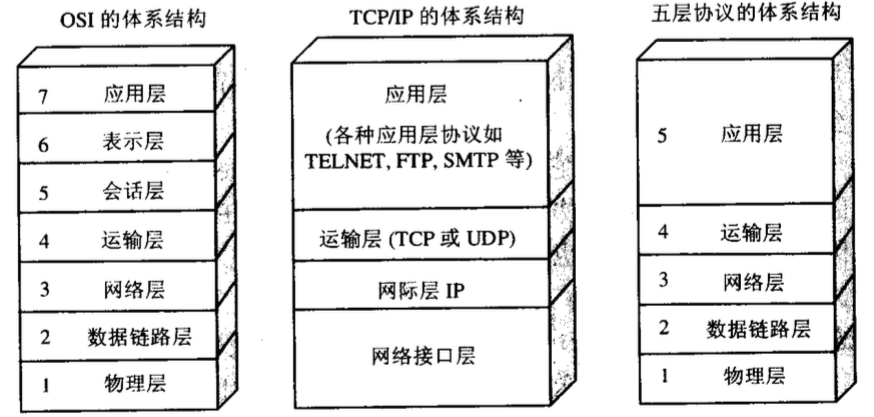

# Computer Network

- [Computer Network](#computer-network)
  - [http协议请求报文、响应报文](#http协议请求报文响应报文)
    - [请求报文(请求行/请求头/请求数据/空行)](#请求报文请求行请求头请求数据空行)
  - [请求响应的具体现实流程](#请求响应的具体现实流程)
  - [状态码](#状态码)
  - [三次握手和四次挥手](#三次握手和四次挥手)
  - [HTTPS是如何保证安全传输的](#https是如何保证安全传输的)
  - [嵌入式服务器](#嵌入式服务器)
  - [Cookie和Session的区别](#cookie和session的区别)
  - [什么的RPC](#什么的rpc)
  - [BIO、NIO、AIO](#bionioaio)
  - [阻塞IO、非阻塞IO、同步IO、异步IO](#阻塞io非阻塞io同步io异步io)
  - [什么是SSO](#什么是sso)
  - [TCP和UDP的区别](#tcp和udp的区别)
    - [UDP协议的特点](#udp协议的特点)
    - [TCP协议的特点](#tcp协议的特点)
  - [NIO核心组件](#nio核心组件)
  - [HTTP与HTTPS区别](#http与https区别)
  - [GET和POST请求区别](#get和post请求区别)
  - [拥塞控制和流量控制](#拥塞控制和流量控制)
  - [拥塞解决的两种方法](#拥塞解决的两种方法)
  - [ARP协议，地址解析协议](#arp协议地址解析协议)
  - [NAT 网络地址转换](#nat-网络地址转换)
  - [MAC地址，媒体存取控制位址](#mac地址媒体存取控制位址)
  - [DR模式，直接路由模式](#dr模式直接路由模式)

- [主页](README.md)

## http协议请求报文、响应报文

### 请求报文(请求行/请求头/请求数据/空行)

**请求行**

求方法字段、URL字段和HTTP协议版本

例如：GET /index.html HTTP/1.1

get方法将数据拼接在url后面，传递参数受限

请求方法：

GET、POST、HEAD、PUT、DELETE、OPTIONS、TRACE、CONNECT

**请求头(key value形式)**

User-Agent：产生请求的浏览器类型。

Accept：客户端可识别的内容类型列表。

Host：主机地址

请求数据

post方法中，会把数据以key value形式发送请求

空行

发送回车符和换行符，通知服务器以下不再有请求头

**响应报文(状态行、消息报头、响应正文)**

状态行

消息报头

响应正文

## 请求响应的具体现实流程

- 1.浏览器发送请求

- 2.服务器接收请求,创建两个对象(request和response),将请求的信息封装request对象

- 3.找到对应的servlet,将这两个对象传递给servlet

- 4.Servlet收到请求,执行service方法,处理自己的业务逻辑,生成动态的内容,将内容返回给服务器

- 5.服务器收到内容之后,进行拆分,生成响应信息,返回给浏览器

- 6.浏览器解析

## 状态码

**200 成功响应**

200 OK，表示从客户端发来的请求在服务器端被正确处理

204 No content，表示请求成功，但响应报文不含实体的主体部分

206 Partial Content ，进行范围请求成功

**300 重定向**

301 moved permanently，永久 性重定向，表示资源已被分配了新的 URL

302 found，临时性重定向，表示资源临时被分配了新的 URL

303 see other，表示资源存在着另一个 URL， 应使用 GET 方法获取资源

**400 客户端响应**

404 Not Found请求失败，请求所希望得到的资源未被在服务器上发现。没有信息能够告诉用户这个状况到底是暂时的还是永久的。假如服务器知道情况的话，应当使用410状态码来告知旧资源因为某些内部的配置机制问题，已经永久的不可用，而且没有任何可以跳转的地址。404这个状态码被广泛应用于当服务器不想揭示到底为何请求被拒绝或者没有其他适合的响应可用的情况下

**500 服务端响应**

500 Internal Server Error服务器遇到了不知道如何处理的情况。

## 三次握手和四次挥手

TCP协议是7层网络协议中传输层协议，负责数据可靠传输。

**三次握手**

客户端向服务端发送SYN

服务端接收SYN之后，给客户端发送一个SYN_ACK

客户端接收到SYN_ACK后，再给服务端发送一个ACK

**四次挥手**

客户端向服务端发送FIN

服务端接收FIN后，向客户端发送ACK，表示我接受到了断开连接的请求，客户端不发送数据，不过服务端可能还有数据正在处理

服务端处理完所有数据后向客户端发送FIN，表示客户端现在可以断开连接

客户算收到服务端的FIN，向服务端发送ACK，表示客户端断开连接

## HTTPS是如何保证安全传输的

**对称加密**的意思就是，加密数据用的密钥，跟解密数据用的密钥是一样的。

**非对称加密**的意思就是，加密数据用的密钥（公钥），跟解密数据用的密钥（私钥）是不一样的。

私钥加密的数据，公钥是可以解开的，而公钥又是加密的。也就是说，非对称加密只能保证单向数据传输的安全性。

客户端向服务器发送数据之前需要先建立TCP连接，之后服务端会先给客户端发送公钥，客户端拿到公钥后就可以用来加密数据。服务端使用私钥解密数据。

但是由于非对称加密较慢，所以不能直接使用非对称加密来传输请求数据，所以可以通过非对称的方式来传输对称加密秘钥，之后就可以使用对称加密来传输请求数据了。

但是仅仅通过非对称加密与对称加密还不足以保证数据传输的绝对安全

所以为了安全传输公钥，需要用到数字证书，服务端向客户端发送公钥时，通过数字证书提供的私钥对摘要信息进行加密生成数字签名，把消息摘要和数字签名一起形成数字证书，发送给客户端。

在这个过程中，就算是有人拦截到服务端提供的数字证书，虽然它可以解密得到非对称加密使用的公钥，但是中间人没办法伪造数字证书发送给客户端。

## 嵌入式服务器

当我们创建一个可以部署的应用程序的时候，我们将会把服务器（例如，tomcat）嵌入到可部署的服务器中。

## Cookie和Session的区别

当服务器第一次接收到客户端请求时，会开辟一块独立session空间，建立session对象，同时会生成一个session id，通过响应头的方式保存到客户端浏览器cookie中。以后客户端每次请求，都会在请求头部带上session id。这样就可以对应上服务端会话信息，比如用户登录状态。

## 什么的RPC

RPC，即 Remote Procedure Call（远程过程调用），是一个计算机通信协议。 该协议允许运行于一台计算机的程序调用另一台计算机的子程序，而程序员无需额外地为这个交互作用编程。

当使用RPC框架实现服务间调用的时候，要求服务提供方和服务消费方 都必须使用统一的RPC框架，要么都dubbo，要么都cxf

当使用http进行服务间调用的时候，无需关注服务提供方使用的编程语言，也无需关注服务消费方使用的编程语言，服务提供方只需要提供restful风格的接口，服务消费方，按照restful的原则，请求服务

## BIO、NIO、AIO

BIO （Blocking I/O）：**同步阻塞I/O模式**，数据的读取写入必须阻塞在一个线程内等待其完成。这里使用那个经典的烧开水例子，这里假设一个烧开水的场景，有一排水壶在烧开水，BIO的工作模式就是， 叫一个线程停留在一个水壶那，直到这个水壶烧开，才去处理下一个水壶。但是实际上线程在等待水壶烧开的时间段什么都没有做。

NIO （New I/O）：**同时支持阻塞与非阻塞模式**，但这里我们以其同步非阻塞I/O模式来说明，那么什么叫做同步非阻塞？如果还拿烧开水来说，NIO的做法是叫一个线程不断的轮询每个水壶的状态，看看是否有水壶的状态发生了改变，从而进行下一步的操作。

AIO （ Asynchronous I/O）：**异步非阻塞I/O模型**。异步非阻塞与同步非阻塞的区别在哪里？异步非阻塞无需一个线程去轮询所有IO操作的状态改变，在相应的状态改变后，系统会通知对应的线程来处理。对应到烧开水中就是，为每个水壶上面装了一个开关，水烧开之后，水壶会自动通知我水烧开了。

## 阻塞IO、非阻塞IO、同步IO、异步IO

一、IO请求的两个阶段：1.等待资源阶段：IO请求一般需要请求特殊的资源（如磁盘、RAM、文件），当资源被上一个使用者使用没有被释放时，IO请求就会被阻塞，直到能够使用这个资源。2.使用资源阶段：真正进行数据接收和发生。

二、在等待数据阶段，IO分为阻塞IO和非阻塞IO。1.阻塞IO： 资源不可用时，IO请求一直阻塞，直到反馈结果（有数据或超时）。2.非阻塞IO：资源不可用时，IO请求离开返回，返回数据标识资源不可用

三、在使用资源阶段，IO分为同步IO和异步IO。1.同步IO：应用阻塞在发送或接收数据的状态，直到数据成功传输或返回失败。2.异步IO：应用发送或接收数据后立刻返回，数据写入OS缓存，由OS完成数据发送或接收，并返回成功或失败的信息给应用。

## 什么是SSO 

SSO－Single Sign On，单点登录

就是通过用户的一次性鉴别登录。当用户在身份认证服务器上登录一次以后，即可获得访问单点登录系统中其他关联系统和应用软件的权限

## TCP和UDP的区别

TCP是一种面向连接的，可靠的，传输层通信协议

UDP是一种无连接的，不可靠的，传输层通信协议

**UDP协议**全称是**用户数据报协议**，在网络中它与TCP协议一样用于处理数据包，是一种无连接的协议。在OSI模型中，在第四层——**传输层**，处于IP协议的上一层。UDP有不提供数据包分组、组装和不能对数据包进行排序的缺点，也就是说，当报文发送之后，是无法得知其是否安全完整到达的。

### UDP协议的特点

> **面向无连接**
>>首先 UDP 是不需要和 TCP一样在发送数据前进行三次握手建立连接的，想发数据就可以开始发送了。并且也只是数据报文的搬运工，不会对数据报文进行任何拆分和拼接操作。具体来说就是：在发送端，应用层将数据传递给传输层的 UDP 协议，UDP 只会给数据增加一个 UDP 头标识下是 UDP 协议，然后就传递给网络层了在接收端，网络层将数据传递给传输层，UDP 只去除 IP 报文头就传递给应用层，不会任何拼接操作

>**有单播，多播，广播的功能** 
>>UDP 不止支持一对一的传输方式，同样支持一对多，多对多，多对一的方式，也就是说 UDP 提供了单播，多播，广播的功能。

>**UDP是面向报文的**
>>发送方的UDP对应用程序交下来的报文，在添加首部后就向下交付IP层。UDP对应用层交下来的报文，既不合并，也不拆分，而是保留这些报文的边界。因此，应用程序必须选择合适大小的报文

>**不可靠性**
>>首先不可靠性体现在无连接上，**通信都不需要建立连接**，想发就发，这样的情况肯定不可靠。并且收到什么数据就传递什么数据，并且也不会备份数据，发送数据也不会关心对方是否已经正确接收到数据了。再者网络环境时好时坏，但是 UDP 因为没有拥塞控制，一直会以恒定的速度发送数据。即使网络条件不好，也不会对发送速率进行调整。这样实现的弊端就是在网络条件不好的情况下可能会导致丢包，但是优点也很明显，在某些实时性要求高的场景（比如电话会议）就需要使用 UDP 而不是 TCP。

>**头部开销小，传输数据报文时是很高效的。**

>>UDP头部包含了以下几个数据：
 两个十六位的端口号，分别为源端口（可选字段）和目标端口
 整个数据报文的长度
 整个数据报文的检验和（IPv4 可选 字段），该字段用于发现头部信息和数据中的错误
 因此 UDP 的头部开销小，只有八字节，相比 TCP 的至少二十字节要少得多，在传输数据报文时是很高效的

### TCP协议的特点

>**面向连接**
>>面向连接，是指发送数据之前必须在两端建立连接。建立连接的方法是“三次握手”，这样能建立可靠的连接。建立连接，是为数据的可靠传输打下了基础。

>**仅支持单播传输**
>>每条TCP传输连接只能有两个端点，只能进行点对点的数据传输，不支持多播和广播传输方式。

>**面向字节流**
>>TCP不像UDP一样那样一个个报文独立地传输，而是在不保留报文边界的情况下以字节流方式进行传输。

>**可靠传输**
>>对于可靠传输，判断丢包，误码靠的是TCP的段编号以及确认号。TCP为了保证报文传输的可靠，就**给每个包一个序号**，同时序号也保证了传送到接收端实体的包的按序接收。然后接收端实体对已成功收到的字节发回一个相应的确认(ACK)；如果发送端实体在合理的往返时延(RTT)内未收到确认，那么**对应的数据（假设丢失了）将会被重传**。

>提供拥塞控制
>>当网络出现拥塞的时候，TCP能够减小向网络注入数据的速率和数量，缓解拥塞

>TCP提供全双工通信
>>TCP允许通信双方的应用程序在任何时候都能发送数据，因为TCP连接的两端都设有缓存，用来临时存放双向通信的数据。当然，TCP可以立即发送一个数据段，也可以缓存一段时间以便一次发送更多的数据段（最大的数据段大小取决于MSS）

## NIO核心组件

1. Channel

Java NIO中的所有I/O操作都基于Channel对象，就像流操作都要基于Stream对象一样，Channel（通道）代表和某一实体的连接，这个实体可以是文件、网络套接字等。

2. Buffer

NIO中所使用的缓冲区不是一个简单的byte数组，而是封装过的Buffer类

3. Selector

Selector（选择器）是一个特殊的组件，用于采集各个通道的状态（或者说事件）。

## HTTP与HTTPS区别

**HTTP：是互联网上应用最为广泛的一种网络协议**

是一个客户端和服务器端请求和应答的标准（TCP），用于从WWW服务器传输超文本到本地浏览器的传输协议，它可以使浏览器更加高效，使网络传输减少。

**HTTPS：是以安全为目标的HTTP通道**

简单讲是HTTP的安全版，**即HTTP下加入SSL层**，HTTPS的安全基础是SSL，因此加密的详细内容就需要SSL。

**SSL(Secure Sockets Layer 安全套接字协议)**

及其继任者传输层安全（Transport Layer Security，TLS）是为网络通信提供安全及数据完整性的一种安全协议。

**区别：**

HTTP是简单无状态的，HTTPS是经过证书加密的安全性更高。

HTTP是免费的，HTTPS需要申请证书

他们传输协议不同，使用的端口不同，http是80端口，https是443

http协议比较费时，所以会影响服务响应速度及吞吐量

https也不是完全安全的，证书体系并不是完全安全的，https在面对ddos这样的攻击的时候几乎起不到任何作用

## GET和POST请求区别

HTTP协议中定义了**浏览器和服务器进行交互的不同方法**，基本方法有4种，分别是GET，POST，PUT，DELETE。这四种方法可以理解为，对服务器资源的查，改，增，删。

GET：从服务器上获取数据，也就是所谓的查，仅仅是获取服务器资源，不进行修改。

POST：向服务器提交数据，这就涉及到了数据的更新，也就是更改服务器的数据。

PUT：英文含义是放置，也就是向服务器新添加数据，就是所谓的增。

DELETE：从字面意思也能看出，这种方式就是删除服务器数据的过程。

1. Get是不安全的，因为在传输过程，数据被放在请求的URL中；Post的所有操作对用户来说都是不可见的。 但是这种做法也不时绝对的，大部分人的做法也是按照上面的说法来的，但是也可以在get请求加上 request body，给 post请求带上 URL 参数。
2. Get请求提交的url中的数据最多只能是2048字节，这个限制是浏览器或者服务器给添加的，http协议并没有对url长度进行限制，目的是为了保证服务器和浏览器能够正常运行，防止有人恶意发送请求。Post请求则没有大小限制
3. Get限制Form表单的数据集的值必须为ASCII字符；而Post支持整个ISO10646字符集。
4. Get执行效率却比Post方法好。Get是form提交的默认方法。
5. GET产生一个TCP数据包；POST产生两个TCP数据包。对于GET方式的请求，浏览器会把http header和data一并发送出去，服务器响应200（返回数据）；而对于POST，浏览器先发送header，服务器响应100 continue，浏览器再发送data，服务器响应200 ok（返回数据）。

## 拥塞控制和流量控制

**流量控制**：如果发送方把数据发送得过快，接收方可能会来不及接收，这就会造成数据的丢失。

TCP的流量控制是利用**滑动窗口机制**实现的，接收方在返回的数据中会包含自己的接收窗口的大小，以控制发送方的数据发送。

**拥塞控制**：拥塞控制就是防止**过多的数据注入到网络中**，这样可以使网络中的路由器或链路不致过载。

两者的区别：流量控制是为了预防拥塞。如：在马路上行车，交警跟红绿灯是流量控制，当发生拥塞时，如何进行疏散，是拥塞控制。流量控制指点对点通信量的控制。而拥塞控制是全局性的，涉及到所有的主机和降低网络性能的因素。

## 拥塞解决的两种方法

发送方控制拥塞窗口的原则是：只要网络没有出现拥塞，拥塞窗口就再增大一些，以便把更多的分组发送出去。但只要网络出现拥塞，拥塞窗口就减小一些，以减少注入到网络中的分组数。

>**慢开始+拥塞避免**
>>一开始的慢开始算法的指数增长是很恐怖的，所以为了防止拥塞窗口增长过快需要设置一个门限ssthresh
 无论在慢开始阶段还是在拥塞避免阶段，只要发送方没有收到确认，就认为这时候拥塞了。
 1.就要把慢开始门限设置为此时窗口值的一半
 2.然后把拥塞窗口重新设置为1，执行慢开始算法。

>**快重传+快恢复**

>>快重传要求接收方在收到一个失序的报文段后就立即发出重复确认
 如果没有快速重传和快速恢复，TCP将会使用定时器来要求传输暂停。在暂停这段时间内，没有新的数据包被发送。所以快速重传和快速恢复旨在快速恢复丢失的数据包。

## ARP协议，地址解析协议

当电脑在通信之前会先在网络上发一个广播，目标IP是网关IP 192.168.1.1，网关（路由器）就会回复自己的MAC。然后，发送方就会通过网关的MAC地址给网关发一条IP报文，报文的目标IP就是接收方的IP地址，来源IP是发送方的IP地址。

**地址解析协议**，即ARP（Address Resolution Protocol），是根据IP地址获取物理地址的一个TCP/IP协议。

## NAT 网络地址转换

NAT（Network Address Translation），是指网络地址转换。是在私有地址和全局地址之间转换的协议，在NAT转换表中呈映射关系。

## MAC地址，媒体存取控制位址

MAC地址（英语：Media Access Control Address），直译为**媒体存取控制位址**，也称为局域网地址（LAN Address），MAC位址，以太网地址（Ethernet Address）或物理地址（Physical Address），它是一个用来**确认网络设备位置**的位址。第二层**数据链路层**则负责MAC位址。第三层网络层负责IP地址。

## DR模式，直接路由模式

DR模式，即(Direct Routing)直接路由模式。当一个client（cip）发送一个WEB请求到virtual server（vip）,例如负载均衡服务器，此时数据包地址cip->vip，然后虚拟服务器仅仅更改MAC地址，选择一台real server（rip），此时数据包地址cip->vip|rip@MAC从而实现返回时直接从real server（rip）到客户（cip）
