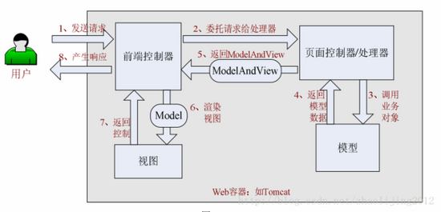

# SpringMVC

- [SpringMVC](#springmvc)
  - [MVC（表现层）](#mvc表现层)
  - [dao层、service层和controller层](#dao层service层和controller层)
  - [Spring MVC请求处理流程](#spring-mvc请求处理流程)
  - [模板引擎](#模板引擎)
  - [SpringIOC](#springioc)

SpringMVC框架是一个基于请求驱动的Web框架

三层架构：表现层、业务层、数据层

## MVC（表现层）

**Model（模型）** - 模型代表一个存取数据的对象或 JAVA POJO。它也可以带有逻辑，在数据变化时更新控制器。

**View（视图）** - 视图代表模型包含的数据的可视化。

**Controller（控制器）** - 控制器作用于模型和视图上。它控制数据流向模型对象，并在数据变化时更新视图。它使视图与模型分离开。

**核心组件**：前端控制器：DispatcherServlet

## dao层、service层和controller层

**DAO层**：DAO层主要是做数据持久层的工作，负责与数据库进行联络的一些任务都封装在此，DAO层的设计首先是设计DAO的接口，然后在Spring的配置文件中定义此接口的实现类，然后就可在模块中调用此接口来进行数据业务的处理，而不用关心此接口的具体实现类是哪个类，显得结构非常清晰，DAO层的数据源配置，以及有关数据库连接的参数都在Spring的配置文件中进行配置。

**Service层**：Service层主要负责业务模块的逻辑应用设计。同样是首先设计接口，再设计其实现的类，接着再Spring的配置文件中配置其实现的关联。这样我们就可以在应用中调用Service接口来进行业务处理。Service层的业务实现，具体要调用到已定义的DAO层的接口，封装Service层的业务逻辑有利于通用的业务逻辑的独立性和重复利用性，程序显得非常简洁。

**Controller层**:Controller层负责具体的业务模块流程的控制，在此层里面要调用Serice层的接口来控制业务流程，控制的配置也同样是在Spring的配置文件里面进行，针对具体的业务流程，会有不同的控制器，我们具体的设计过程中可以将流程进行抽象归纳，设计出可以重复利用的子单元流程模块，这样不仅使程序结构变得清晰，也大大减少了代码量。

**View层**：此层与控制层结合比较紧密，需要二者结合起来协同工发。

## Spring MVC请求处理流程

- 首先用户发送请求到前端控制器，前端控制器根据请求信息（如 URL）来决定选择哪一个页面控制器进行处理并把请求委托给它，即以前的控制器的控制逻辑部分；图中的 1、2 步骤；

- 页面控制器接收到请求后，进行功能处理，首先需要收集和绑定请求参数到一个对象，这个对象在 Spring Web MVC 中叫命令对象，并进行验证，然后将命令对象委托给业务对象进行处理；处理完毕后返回一个 ModelAndView（模型数据和逻辑视图名）；图中的 3、4、5 步骤；

- 前端控制器收回控制权，然后根据返回的逻辑视图名，选择相应的视图进行渲染，并把模型数据传入以便视图渲染；图中的步骤 6、7；

- 前端控制器再次收回控制权，将响应返回给用户，图中的步骤 8；至此整个结束。

## 模板引擎

Thymeleaf：生成动态HTML

常用语法：标准表达式、判断与循环、模板与布局

## SpringIOC

Spring 通过一个配置文件描述 Bean 及 Bean 之间的依赖关系，Spring 的 IoC 容器在完成这些底层工作的基础上，还提供了 Bean 实例
缓存、生命周期管理、 Bean 实例代理、事件发布、资源装载等高级服务。

Spring 的 IoC 容器可以建立父子层级关联的容器体系，子容器可以访问父容器中的 Bean，但父容器不能访问子容器的 Bean.