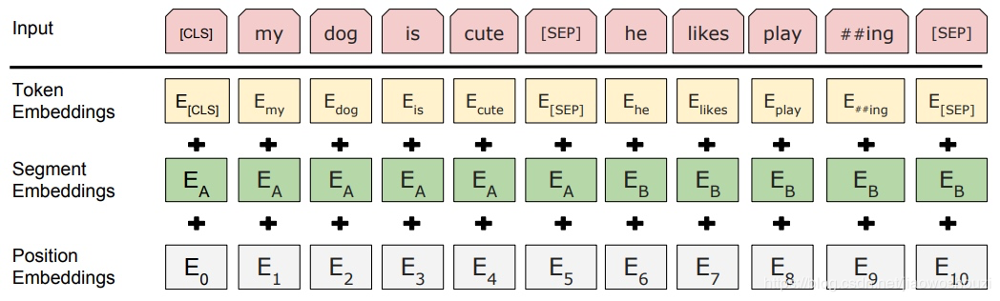

# project summary

- [project summary](#project-summary)
  - [项目难点](#项目难点)
    - [需求难点和沟通难点](#需求难点和沟通难点)
    - [技术难点](#技术难点)
      - [TF-IDF（term frequency–inverse document frequency）](#tf-idfterm-frequencyinverse-document-frequency)
      - [one-hot encoder到Word2vec](#one-hot-encoder到word2vec)
      - [BERT算法模型选取](#bert算法模型选取)
      - [Transformer parameter](#transformer-parameter)

- [主页](README.md)

## 项目难点

### 需求难点和沟通难点

**难点**：远程沟通，难以获得客户具体需求

解决方法：运用敏捷项目管理方法

- 利用statement of work确立客户需求
- 绘制User story map站在使用者角度确定每一阶段任务（算法，前后端交互）
- 利用trello，JIRA，confluence，git等工具统一管理项目

**难点**：客户想要一个类似谷歌搜索引擎，如何最大化实现客户目标

- 资料收集（论文等）
- domain model（领域模型）绘制，确定后端功能间交互方法（数据库中四张表，不同的entity）
- Sequence diagram（流程图）
  
---

### 技术难点

**解决方法：** 视频、谷歌、书籍（Thinking of java、computer network top to down）

#### TF-IDF（term frequency–inverse document frequency）

TF是词频，IDF是逆文本频率指数。

#### one-hot encoder到Word2vec

one-hot encoder利用Scikit-learn包中OneHotEncoder()方法表示段落矩阵

另一种词嵌入（word embedding)方法Word2vec。利用Scikit-learn包RoBERTa base model中tokenizer方法

Token Embeddings：是词向量，第一个单词是CLS标志，可以用于之后的分类任务

Segment Embeddings：将句子分为两段，用来区别两种句子，因为预训练不光做LM还要做以两个句子为输入的分类任务

Position Embeddings：和之前文章中的Transformer不一样，不是三角函数而是学习出来的

#### BERT算法模型选取

RNN到LSTM到transformer到BERT

#### Transformer parameter

d_model：embedding size 512

d_feedForward：两次线性层中的隐藏层 512->2048->512

d_K = d_Q = d_V：attention中三个参数维度，一般K=Q，这里方便计算使K=V=64

n_layer：number of decoder and encoder layer （相当于有多少个blocks）6

n_head：heads in Multi-Head Attention 8

